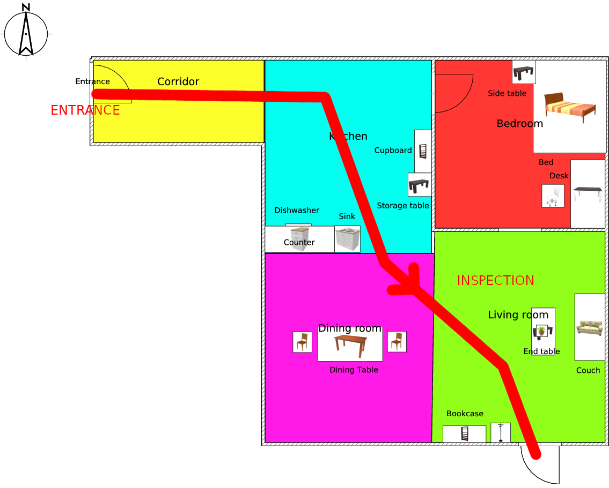

# RoboCup@Home 2018 | Montreal, Canada

Schedules, data, and applications for the RoboCup world championship 2018 taking place in Montreal, Canada

### Quick Links
Test Schedule

#### Data Files
- Arena map and locations
- List of official names
- List of objects and categories
- List of predefined questions

#### Applications
- Questions generator **_Speech and Person Recognition_** test
- Command generator for the **_GPSR_** test
- Command generator for the **_EEGPSR_** test

# Task Information

## Arena

Note this is a preliminary version, as the furniture still is under construction

## Objects

* For training you are allowed to take two objects per team for a short time and then return it
* Objects have been bought at IGA. You can buy them on your own for training
* [Object List](Files/Objects.pdf)

## Stage 1

### Robot Inspection

### Speech and Person Recognition

<!---->

### Help Me Carry

<!---->

### Storing Groceries

<!---->

### GPSR

<!---->

